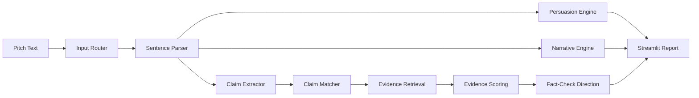

# Architecture

## System Objective

Solar Claim Review converts an unstructured residential solar sales pitch into three coordinated analytical outputs:

1. persuasion/manipulation analysis;
2. narrative and assessment-quality analysis;
3. claim-by-claim evidence review.

The system is intentionally modular so those outputs do not contaminate one another.

## High-Level Components



## Input Router

`evidence_engine/input_router.py`

The router enforces a mandatory behavior rule:

- in-scope text must receive a response;
- off-topic text is explicitly marked `OUTSIDE_PROJECT_SCOPE`;
- unknown but relevant claims become `UNMAPPED_SOLAR_CLAIM` rather than disappearing.

This layer exists because silent false negatives are particularly damaging in a review tool.

## Claim Extraction

`evidence_engine/claim_extractor.py`

The extractor splits the pitch into semantic units and permits multiple claim families in one sentence.

Example:

```text
"It cannot cost you anything and it has to be less than your current bill."
```

can produce both:

```text
zero_cost
guaranteed_savings
```

The architecture avoids a single-label bottleneck.

## Claim Ontology

`data/claim_ontology.json`

Each claim family contains:

- an internal claim type;
- a human-readable name;
- a description;
- example phrasings;
- important phrases;
- semantic signature patterns.

The ontology is transparent and editable, which makes the current prototype auditable before a trained classifier replaces or augments it.

## Persuasion Engine

`evidence_engine/pitch_story_analyzer.py`

The engine searches for persuasion mechanisms independently of factual accuracy.

A phrase can therefore be:

- factually true but presented coercively;
- factually false but neutrally phrased;
- both misleading and coercive;
- neither.

This separation is intentional.

## Narrative Engine

The narrative layer reconstructs the overall progression of a pitch rather than relying on a list of isolated keywords.

For a longer script, the engine identifies:

- opening premise;
- development/bridge;
- intended destination.

For a one-sentence input, it still produces a premise → implication → intended-direction interpretation.

## Ethical Assessment Benchmark

`evidence_engine/ethical_benchmark.py`

The benchmark is not a fact-check source. It evaluates the sales approach against a fact-first assessment philosophy:

- use annual utility data;
- treat savings as variable;
- evaluate site and financing;
- begin with analysis rather than a predetermined sale;
- do not force a recommendation.

Keeping this outside the evidence system avoids circular reasoning.

## Evidence Registry

`data/source_registry.json`

The source registry records metadata such as:

- publisher;
- title;
- URL;
- source type;
- jurisdiction;
- authority score;
- volatility;
- as-of date;
- topic tags;
- tier.

The current portfolio includes 50 reviewed sources.

## Evidence Store

`data/seed_evidence.json`

The evidence store contains reviewed propositions associated with standardized claim types.

A source can support multiple evidence propositions, and a claim can retrieve multiple sources.

This design separates:

```text
SOURCE
```

from:

```text
REVIEWED PROPOSITION FROM THAT SOURCE
```

That distinction is critical to prevent keyword retrieval from being mistaken for fact checking.

## Evidence Confidence

The current confidence framework combines:

```text
Authority
Relevance
Freshness
Claim Match
```

The score is a prototype ranking score rather than a calibrated probability of truth.

Future trained versions should calibrate confidence against held-out labeled data.

## Local Database

`build_db.py` creates the SQLite evidence database from the public JSON registries.

The generated `.db` file is not committed to GitHub. This keeps the repository deterministic and makes the evidence model inspectable in source control.

## Public vs Internal Tooling

The public Streamlit UI exposes only:

- Full Pitch Review;
- Evidence Library.

Source-refresh functionality is deliberately shelved for a future private/admin workflow so end users cannot mutate the evidence corpus from the public interface.
