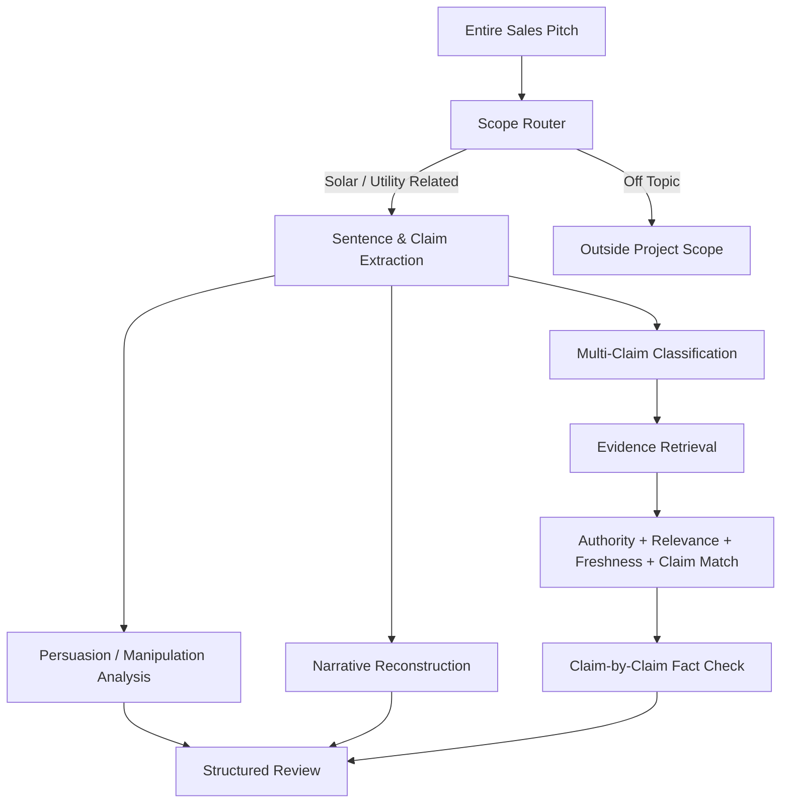

# Solar Claim Review

A Python + Streamlit research prototype for analyzing residential solar sales pitches as **language, narrative, and evidence**.

The project began as a loose question: *Can a sales pitch be broken down in a way that separates persuasion from factual accuracy?* That question evolved into a structured pipeline that now decomposes a full pitch into independently testable claims, evaluates how the wording attempts to influence a homeowner, reconstructs the story the pitch is telling, and retrieves reviewed evidence for each factual claim.

> **Project status:** portfolio-ready prototype. The current system is rule-based and ontology-driven, not a trained machine-learning classifier. The next major stage is labeled-data collection, model training/calibration, and broader validation before public production deployment.

## Why This Project Exists

Residential solar decisions can involve utility tariffs, incentives, financing, contracts, roof conditions, system production, and long-term assumptions. Sales conversations often compress those complexities into short narratives designed to move quickly from problem → solution → appointment.

This project asks three separate questions:

1. **How is the pitch trying to influence the homeowner?**
2. **What larger story is the pitch asking the homeowner to accept?**
3. **Which factual claims can be checked against reviewed evidence?**

Keeping those questions separate is central to the architecture. A persuasive statement is not automatically false, and a factually supportable statement is not automatically presented responsibly.

## Core Pipeline



The system deliberately avoids forcing one label onto an entire pitch. A single script can contain several different factual claims and several different persuasion mechanisms.

## Example: One Pitch, Multiple Claims

A pitch may contain statements equivalent to:

```text
Claim 1: The state requires renewable energy.
Claim 2: The mandate causes higher delivery fees.
Claim 3: Delivery fees fund solar installations.
Claim 4: Solar installation has no cost.
Claim 5: The utility bill disappears.
Claim 6: The replacement solar payment is fixed.
Claim 7: The program guarantees savings.
Claim 8: The home must meet a qualification threshold.
```

The application processes those independently:

```text
ENTIRE PITCH
      ↓
CLAIM EXTRACTION
      ↓
EACH CLAIM CLASSIFIED SEPARATELY
      ↓
EACH CLAIM SEARCHES ITS OWN EVIDENCE
      ↓
EACH CLAIM RECEIVES ITS OWN FACT-CHECK DIRECTION
```

## The Three Analytical Sections

### 1. Wording & Persuasion Analysis

This layer focuses on **how the language attempts to move the homeowner**, not whether the underlying statement is true.

Current rule families include:

- authority / institutional borrowing;
- social proof and borrowed trust;
- personal trust challenges;
- social-rejection pressure;
- reciprocity and personal-credit claims;
- qualification / scarcity framing;
- urgency and time compression;
- forced-choice closing;
- mandatory-language framing;
- certainty / guaranteed-outcome framing;
- problem amplification.

The report explains the mechanism, the likely effect on the homeowner, and how multiple techniques can reinforce each other.

### 2. Narrative & Ethical Assessment

A pitch is treated as a story rather than a bag of keywords.

The narrative layer reconstructs:

- the **opening premise** the homeowner is asked to accept;
- how the pitch **develops that premise** into a consequence, explanation, or benefit;
- where the pitch is **trying to lead the homeowner**.

The project also contains a reference-only ethical assessment benchmark derived from a separate solar-assessment handbook. It is **not** used as fact-check evidence. Instead, it asks whether the pitch follows a fact-first assessment process: annual usage, site conditions, financing, variable savings, and a willingness to conclude that solar may not be the right decision.

### 3. Claim-by-Claim Fact Check

Each factual claim is mapped to reviewed evidence rather than fact-checking the pitch as a single object.

Evidence is scored using four dimensions:

```text
SOURCE AUTHORITY
SOURCE RELEVANCE
SOURCE FRESHNESS
CLAIM MATCH
-------------------
EVIDENCE CONFIDENCE
```

This helps distinguish between:

- a current Massachusetts regulator page;
- a utility tariff;
- an older consumer article;
- an independent market source;
- a claim that still lacks enough evidence.

The system can explicitly return:

```text
NOT_ENOUGH_EVIDENCE
REQUIRES_ADDITIONAL_EVIDENCE
OUTSIDE_PROJECT_SCOPE
```

instead of inventing certainty.

## Evidence Portfolio

The repository ships with a **50-source evidence portfolio**:

- **38 primary-tier sources** from Massachusetts regulators/public agencies, National Grid, Eversource, and MassCEC;
- **12 independent/private sources** used for secondary market, financing, contract, and industry context.

Primary sources are intentionally weighted above independent/private sources when the question concerns law, tariffs, SMART, net metering, utility billing, or program eligibility.

The public repository stores:

- `data/source_registry.json` — source metadata and authority tiers;
- `data/claim_ontology.json` — standardized claim families and natural-language examples;
- `data/seed_evidence.json` — reviewed evidence propositions;
- `data/ethical_assessment_benchmark.json` — reference-only assessment principles.

The SQLite database is generated locally and is intentionally excluded from version control.

## Repository Structure

```text
solar-claim-review/
├── app.py
├── build_db.py
├── requirements.txt
├── ENGINE_RULES.md
├── evidence_engine/
│   ├── claim_extractor.py
│   ├── claim_matcher.py
│   ├── database.py
│   ├── ethical_benchmark.py
│   ├── freshness.py
│   ├── free_text_pipeline.py
│   ├── ingest.py
│   ├── input_router.py
│   ├── pitch_pipeline.py
│   ├── pitch_story_analyzer.py
│   └── retrieval.py
├── data/
│   ├── claim_ontology.json
│   ├── ethical_assessment_benchmark.json
│   ├── seed_evidence.json
│   └── source_registry.json
├── docs/
│   ├── ARCHITECTURE.md
│   ├── METHODOLOGY.md
│   ├── PROJECT_EVOLUTION.md
│   ├── TRAINING_ROADMAP.md
│   ├── SOURCE_GOVERNANCE.md
│   ├── EXAMPLE_OUTPUT.md
│   └── PORTFOLIO_CASE_STUDY.md
├── samples/
│   ├── sample_pitch_high_pressure.txt
│   ├── sample_pitch_fact_first.txt
│   └── sample_claim_threshold.txt
└── tests/
```

## Running the Prototype

Create a virtual environment if desired, then install dependencies:

```bash
pip install -r requirements.txt
```

Build the local evidence database:

```bash
python build_db.py
```

Launch Streamlit:

```bash
streamlit run app.py
```

Run the test suite:

```bash
python -m unittest discover -s tests -v
```

## Important Engineering Decisions

### Multi-claim extraction instead of one winning label

Early prototypes tried to map a full pitch to one dominant claim family. That failed when a single script contained separate assertions about utility bills, government programs, eligibility, pricing, and savings. The current architecture extracts and evaluates each factual claim independently.

### Complete-sentence extraction instead of character windows

Early regex output clipped text around a match, producing fragments such as partial words. The current parser resolves the full sentence containing the match before rendering user-facing analysis.

### Mandatory fallback behavior

Relevant solar/utility text is never silently ignored. If no known claim family fits, the system creates an `UNMAPPED_SOLAR_CLAIM` and explains what evidence would be required.

### Reviewed evidence vs raw retrieved text

A webpage is not automatically treated as proof because it contains similar keywords. Only reviewed evidence propositions receive a stance. Raw source text is kept separate from fact-check conclusions.

### Freshness depends on source volatility

A six-year-old definition can still be useful; a six-year-old tariff, incentive amount, or tax rule may not be. Freshness therefore decays faster for volatile source types.

## From Scattered Idea to Working Prototype

This repository intentionally documents the evolution of the project because the engineering process is part of the case study.

```text
Manual pitch critique
        ↓
Keyword / regex experiment
        ↓
Structured persuasion rules
        ↓
Evidence dictionary
        ↓
Source hierarchy + freshness
        ↓
Multi-claim decomposition
        ↓
Narrative reconstruction
        ↓
Mandatory fallback rules
        ↓
50-source evidence portfolio
        ↓
Current Streamlit prototype
        ↓
NEXT: labeled data + trained models
```

See [`docs/PROJECT_EVOLUTION.md`](docs/PROJECT_EVOLUTION.md) for the full engineering history.

Additional documentation:

- [`docs/ARCHITECTURE.md`](docs/ARCHITECTURE.md) — technical component design.
- [`docs/METHODOLOGY.md`](docs/METHODOLOGY.md) — analytical methodology.
- [`docs/SOURCE_GOVERNANCE.md`](docs/SOURCE_GOVERNANCE.md) — evidence and source-maintenance policy.
- [`docs/EXAMPLE_OUTPUT.md`](docs/EXAMPLE_OUTPUT.md) — simplified synthetic example.
- [`docs/PORTFOLIO_CASE_STUDY.md`](docs/PORTFOLIO_CASE_STUDY.md) — client/portfolio framing.
- [`docs/GITHUB_PUBLISHING_GUIDE.md`](docs/GITHUB_PUBLISHING_GUIDE.md) — publication steps.
- [`docs/REPOSITORY_METADATA.md`](docs/REPOSITORY_METADATA.md) — suggested GitHub description/topics.

## What Still Needs to Happen Before Production

The current prototype demonstrates the pipeline, but it should **not** be presented as a trained AI compliance product.

The next major stage is data:

1. collect a labeled corpus of solar pitches and individual claims;
2. label persuasion techniques, claim boundaries, claim families, and evidence outcomes;
3. measure inter-rater agreement;
4. establish train/validation/test splits;
5. train and compare text-classification / semantic-retrieval approaches;
6. calibrate confidence scores against observed performance;
7. test false positives and false negatives on unseen pitches;
8. expand evidence coverage beyond Massachusetts;
9. perform legal/compliance review before public consumer deployment.

See [`docs/TRAINING_ROADMAP.md`](docs/TRAINING_ROADMAP.md).

## Portfolio Value

Although solar is the demonstration domain, the architecture is transferable to other text-heavy workflows where a client needs to convert unstructured language into structured, auditable analysis—for example:

- sales QA;
- compliance review;
- customer-support audits;
- claims review;
- policy-to-script comparison;
- contract/disclosure QA;
- training-material evaluation;
- call-center quality analysis.

The project demonstrates Python application development, text parsing, rule systems, source governance, evidence retrieval, analytical scoring, Streamlit prototyping, test-driven iteration, and the design of a future ML/NLP training pipeline.

## Limitations

This repository is an analytical research prototype. It does not determine fraud, legal liability, tax eligibility, guaranteed savings, or whether a solar system is financially appropriate for a specific homeowner. Real decisions require the actual utility tariff, contract, financing terms, property conditions, system design, production assumptions, and current law/program rules.

## Independence / Project Identity

This repository is a standalone project with its own architecture, codebase, terminology, source model, and roadmap. It is intentionally presented independently from any other framework or prior project.
